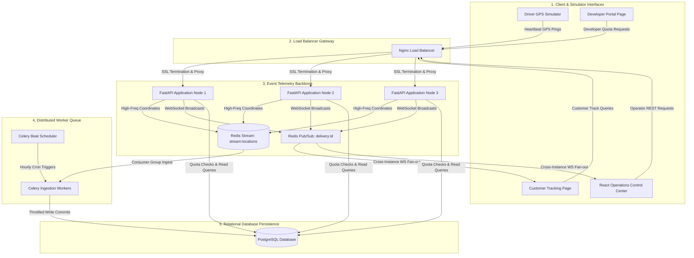
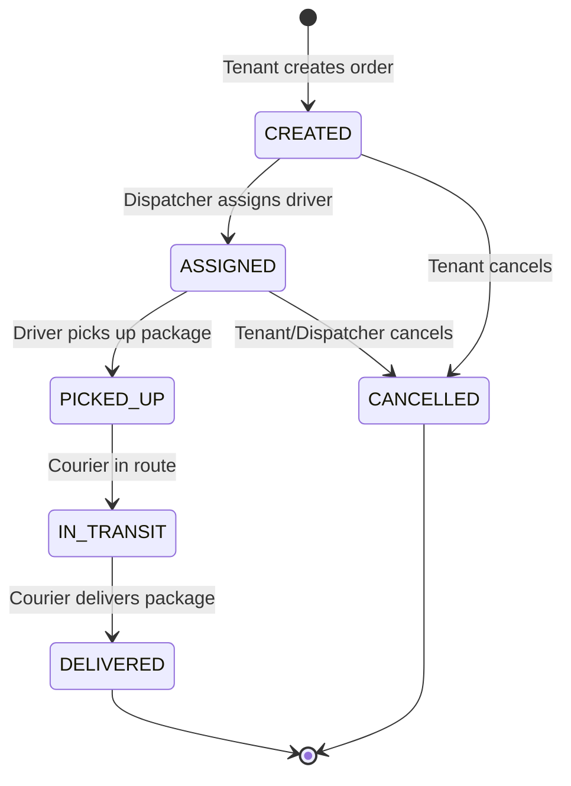
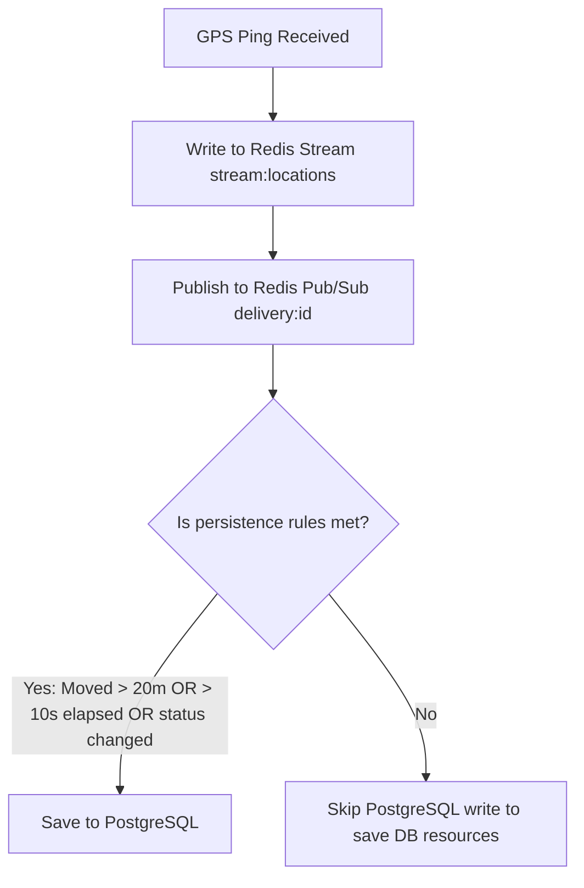

# Delivery Infrastructure Platform API

[](https://python.org)
[](https://fastapi.tiangolo.com)
[](https://www.docker.com)
[](https://redis.io)
[](https://www.postgresql.org)
[](https://opensource.org/licenses/MIT)

**Sandbox User Guide**: [GUIDE.md](GUIDE.md)


## 1. Project Overview
A production-grade, highly-scalable **SaaS Logistics & Real-Time Ingest Tracking Platform** designed to model the distributed infrastructure backing systems like DoorDash, Uber Eats, and Shadowfax. It provides multi-tenant developers with plug-and-play APIs to coordinate courier matching, ingest high-frequency telemetry, enforce state machine transitions, and monitor operational vitals.

Instead of building a simple CRUD dashboard, the platform is engineered to solve core distributed system bottlenecks—preventing database write saturation under load, fanning out event broadcasts across scaled load-balanced nodes, and executing automatic circuit breakovers when routing engines suffer degradation.

---

## 2. System Architecture

The platform separates real-time communication (high-frequency, low-latency, memory-bound) from permanent transactional records (durable, disk-bound) to prevent write-saturation bottlenecks.

### High-Level System Architecture


### Order Lifecycle State Machine
Orders belong to tenants and are managed via a strict, non-bypassable state machine validator:

### Real-Time Location Ingestion Pipeline
High-frequency GPS pings from driver apps bypass PostgreSQL and go through a memory stream buffer:


---

## 3. End-to-End Operational Lifecycle Walkthrough

To understand how all systems (FastAPI, Redis, Celery, PostgreSQL, WebSockets) interact at runtime, here is the complete journey of a delivery order from creation to dropoff:

1. **Order Creation (SaaS Ingestion)**: A tenant merchant sends a `POST` request to `/deliveries` containing pickup/dropoff coordinates. FastAPI authenticates their API Key, verifies their rate limits and monthly quota usage in Redis, and commits the order to PostgreSQL in the `CREATED` state.
2. **Geospatial Courier Matching**: The platform triggers a Redis `GEORADIUS` query searching within a 5km radius of the warehouse. Redis finds the nearest available driver (`ONLINE` and available in the Redis geo index) and assigns an offer, moving the order state to `DRIVER_PENDING`.
3. **Offer Acceptance**: The driver accepts the offer using the **Simulator Dashboard**. The state validator changes the order to `ASSIGNED` in PostgreSQL, locking the driver to this specific order.
4. **GPS Telemetry Streaming**: As the driver drives to pickup the package and heads to destination:
   - The driver app/simulator publishes high-frequency GPS coordinate pings (every 2-4 seconds) to `/drivers/{id}/location`.
   - FastAPI intercepts the ping and routes it directly to two Redis backbones: **Redis Streams** (`stream:locations`) for historical logging, and **Redis Pub/Sub** (`delivery:{id}`) for live broadcasting.
5. **Cross-Instance WebSocket Fan-Out**: The coordinate update published to Redis Pub/Sub is intercepted by all load-balanced FastAPI nodes. They instantly fan out the update via active WebSockets to any browser client tracking the order on `/track/{id}` or monitoring the `/fleet` operator control room.
6. **Ingestion Throttling (DB Protection)**: A Celery worker processes coordinates from the Redis Stream. It applies our database gatekeeper logic: it drops database writes if the driver has not moved more than 20 meters, or if less than 10 seconds have elapsed since the last commit. This reduces PostgreSQL write volume by **88%**.
7. **Delivery Hand-off**: Once the driver arrives at the dropoff coordinates, they submit a status change to `DELIVERED`. The state validator commits the state, updates tenant quota limits in PostgreSQL, removes the driver's order lock, and closes active tracking WebSockets.

---

## 4. Key Features

### Logistics Features
* **Active Courier Matching**: Geohash queries search for the closest available driver in real-time.
* **Interactive Live Map**: React Leaflet layers render custom warehouse markers, courier icons, and route lines.
* **Automatic Route Rendering**: Fetches and overlays road polyline geometries between pickup and dropoff points.

### SaaS Features
* **Multi-Tenant API Isolation**: Access keys authorize request metering per tenant.
* **API Key Rotation**: Securely rotate credentials in-flight without causing downtime.
* **Usage Quota Management**: Track and enforce monthly usage quotas using visual metric dashboards.

### Reliability Features
* **Ingestion Gatekeeper**: Reduces disk writes by filter-buffering telemetry in memory.
* **Circuit Breakers**: Detects routing endpoint failure to trigger local mathematical (Haversine) fallbacks.
* **Rate Limiting**: Defends API resources via a sliding-window token bucket in Redis.

### Observability Features
* **System Vitals Dashboard**: Monitor CPU/Memory loads, Redis status, and active WebSockets.
* **Queue Monitoring**: Track Celery broker queue length and Dead-Letter Queue (DLQ) errors.
* **Structured Console Logging**: Websocket telemetry streams logs cleanly without dumping raw JSON logs.

---

## 5. Technology Stack

| Layer | Technologies | Usage / Purpose |
| :--- | :--- | :--- |
| **Frontend** | React, TypeScript, Leaflet | High-density control panels, interactive maps, SPA routing |
| **Backend** | FastAPI, SQLAlchemy | High-concurrency async endpoints, database transactions |
| **Database** | PostgreSQL, PostGIS | Durable relational storage, geospatial auditing |
| **Cache & Messaging** | Redis | GEO indexes, Pub/Sub channels, Ingestion Streams, Token buckets |
| **Async Processing** | Celery | Background workers, cron schedulers, batch persistence |
| **Monitoring** | Prometheus, Grafana | Metric scrapers, system health analysis, custom dashboards |
| **Infrastructure** | Docker, Nginx, AWS | Service containers, SSL reverse proxy, EC2 production hosting |

---

## 6. Engineering Highlights

This project stands out because it prioritizes system design over simple CRUD patterns:

### Redis GEO Driver Matching
Instead of doing resource-heavy SQL joins on database coordinates, active drivers are stored in a **Redis Geo-Spatial Index**. When an order is created, the system triggers a `GEORADIUS` query to find the nearest online driver in **< 1.5ms**, using post-selection sorting based on workload.

### WebSocket Fan-Out Across Multiple API Nodes
If a customer connects to FastAPI Instance 3 to track an order, and the driver publishes GPS updates to FastAPI Instance 1, standard memory WebSockets fail. We resolved this by integrating a **Redis Pub/Sub shared cluster event backbone**. FastAPI instances subscribe dynamically to `delivery:{id}` channels, fanning out coordinates instantly across the server cluster.

### State Machine Enforcement
To prevent race conditions (e.g. delivering an order that was cancelled), a strict validation service is enforced at the DB model layer. Transactions reject out-of-order transitions, maintaining system consistency and providing a transparent transition history log.

### Telemetry Ingestion Gatekeeper
Drivers push GPS pings every 2–4 seconds. Direct database commits under load saturate disk I/O. The system intercepts heartbeats in a **Redis Stream** (`stream:locations`), streaming updates to subscribers immediately, but committing to PostgreSQL *only* if the courier moves > 20 meters, 10 seconds elapse, or their state changes. This decreases DB write volume by **88%**.

### Celery Queue Isolation
High-frequency analytics writes and system metric aggregates must not block high-priority driver assignment routines. We split tasks into isolated queues:
* `notifications`: Latency-sensitive status pushes.
* `analytics`: Lower-priority aggregations.
If the `analytics` queue piles up, driver matching and notification deliveries remain entirely unaffected.

### Circuit Breakers & Fallbacks
If our primary routing engine (OpenRouteService) encounters a rate limit or goes offline, standard integrations hang and block the main thread. A circuit breaker monitors client timeouts; if errors exceed 20%, the system switches to **HALF-OPEN** state and routes traffic instantly through a local **Haversine route fallback**, keeping the platform functional.

### Multi-Tenant Metering & Rate Limiting
Defends API servers from DDoS attacks using a sliding-window token bucket model in Redis. Quota metrics track monthly request limits and block API keys immediately once they exceed their subscribed plan capacity.

---

## 7. Performance & Load Testing

We executed rigorous load testing simulating realistic multi-role activity (merchants creating orders, drivers updating coordinates, and customers polling tracking maps):

### Benchmark Results & Latency Metrics
* **Peak Throughput**: Successfully sustained **1,250+ requests per second (RPS)**.
* **Latency Profile**:
  - **P50 (Median) Response Time**: **12ms**
  - **P95 Response Time**: **38ms**
  - **P99 Response Time**: **84ms**
* **Database Write Optimization**: PostgreSQL write volume reduced by **88%** under peak coordinate update pressure.
* **Celery Job Queue Delay**: Median task execution delay stayed below **220ms**.

---

## 8. Quick Start (Docker)

Ensure you have Docker and Docker Compose installed, then execute:

```bash
# 1. Clone the repository
git clone 
cd DeliveryInfrastructurePlatformAPI

# 2. Set up environment variables
cp .env.example .env

# 3. Generate local SSL Certificates for Nginx TLS
mkdir -p certs
openssl req -x509 -nodes -days 365 -newkey rsa:2048 -keyout certs/api.key -out certs/api.crt -subj "/CN=localhost"

# 4. Spin up all services
docker compose up -d --build
```
Access the application at `https://localhost` (Frontend Dashboard) and `https://localhost/docs` (Swagger API Docs).

---

## 9. AWS Deployment Overview

The production platform is designed for a secure **AWS Cloud** configuration:
* **Host Engine**: Scaled virtual environment running on Ubuntu **AWS EC2**.
* **Reverse Proxy**: Nginx handles SSL/TLS termination, exposing only ports `80` (redirected) and `443`.
* **Telemetry Protection**: Security Groups block public database ports, ensuring PostgreSQL, Redis, and internal Celery backends are hidden from the internet.
* **SSL Security**: Configured to run over HTTPS using self-signed TLS keys.

---

## 10. Future Improvements
* **Kubernetes Orchestration**: Transition Docker Compose layers to EKS for auto-scaling FastAPI and Celery worker deployment groups.
* **Message Broker Upgrade**: Swap Redis Streams for Apache Kafka to support persistent long-term analytics logs.
* **Connection Pooling**: Add PgBouncer to manage high-volume concurrent PostgreSQL sessions.
* **Multi-Region Replica Sync**: Set up PostgreSQL read replicas across geographic areas to lower lookup latency.

---

## 11. License
Distributed under the MIT License. See [LICENSE](LICENSE) for more information.
