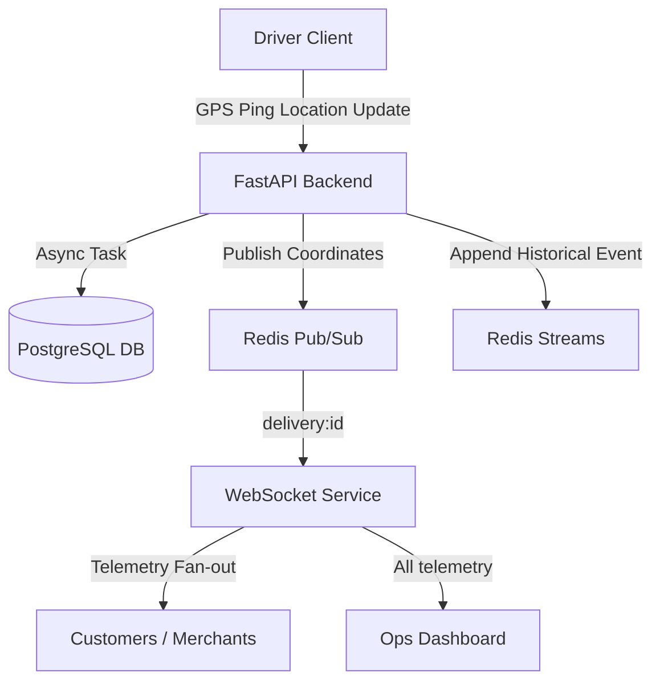
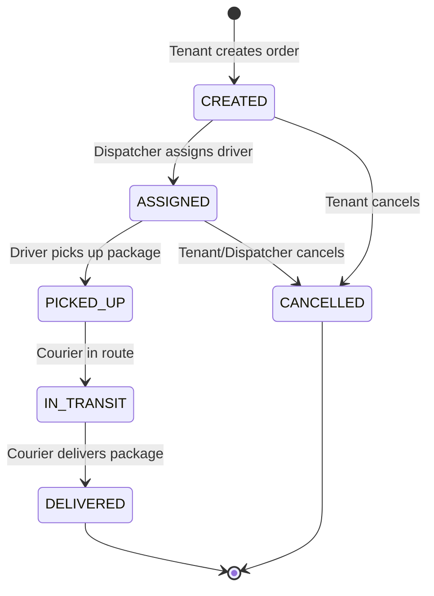
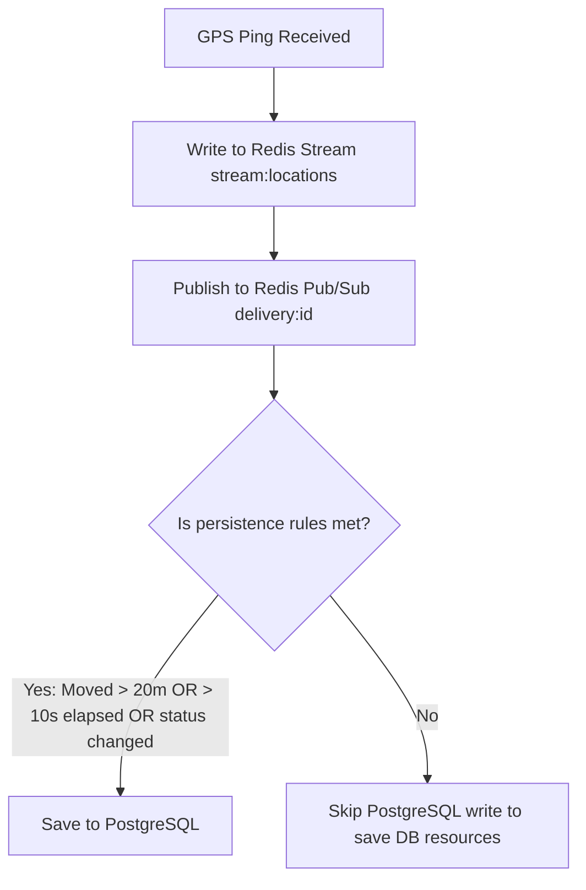

# System Design & Architecture Document

This document outlines the architectural flow, component designs, and design decisions implemented in the **Delivery Infrastructure Platform**.

---

## 1. High-Level Architecture

The platform separates real-time communication (ephemeral, high-frequency) from permanent storage (durable, transactional).



---

## 2. Core Flows

### 2.1 Order Lifecycle Flow
Orders belong to tenants (e.g., Pizza Shop, Burger Shop) and are managed via a strict state machine validator:



---

### 2.2 Location Update & Persistence Pipeline
To scale database writes, GPS pings from driver phones go through a persistence gatekeeper:



---

## 3. Redis Architectural Design

### 3.1 Pub/Sub (Live Broadcast)
- **Scoped Channels**: Each delivery has a dedicated channel: `delivery:{delivery_id}`.
- **Why?** Clients only receive events for the delivery they are tracking. This restricts the message fan-out footprint compared to a single global channel.

### 3.2 Streams (Event Registry / Black Box)
- **Stream Name**: `stream:locations`.
- **Key Fields**: `driver_id`, `lat`, `lng`, `timestamp`.
- **Why?** Ephemeral channels lose messages if a client drops connection. Streams provide a durable, replayable history log of every single coordinate ping. This data feeds analytics, historical route reconstruction, and future ETA prediction models.

### 3.3 Live Location Cache
- **Key Structure**: `delivery:{delivery_id}:live_location` (TTL: 300 seconds).
- **Why?** When a customer tracking page loads, querying PostgreSQL for the driver's location creates high read volumes. Caching the latest location in Redis lets the client render the map instantly.

---

## 4. WebSocket Infrastructure

- **`WS /track/{delivery_id}`**: Customers and merchants subscribe to updates for a specific order. The connection manager spawns a background Redis subscription listener task on the first client connection, and destroys it when the last client disconnects to prevent resource leaks.
- **`WS /fleet`**: The operations dashboard receives location coordinates for all active deliveries in real-time.

---

## 5. Directory Structure
```text
backend/app/
├── api/          # Route controllers (deliveries, drivers, websockets)
├── core/         # Settings configs, exceptions, and geo math helpers
├── db/           # Session setup (Postgres + Redis clients) and base schemas
├── dependencies/ # Tenant api key headers auth
├── models/       # Database tables (Tenant, Driver, Order, StateTransition)
├── schemas/      # Pydantic validation schemas
└── services/     # OrderStateMachine, DeliveryService, DriverService
```
